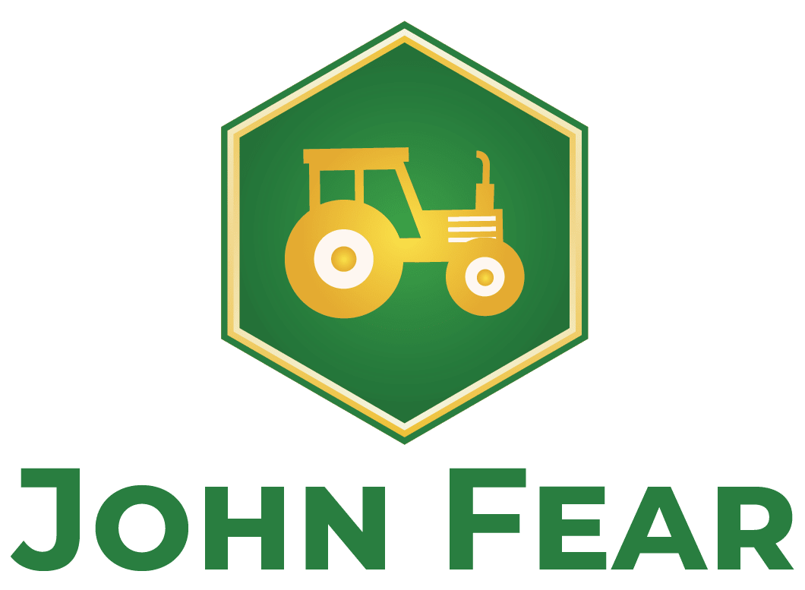
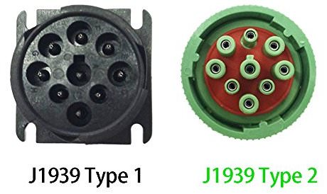
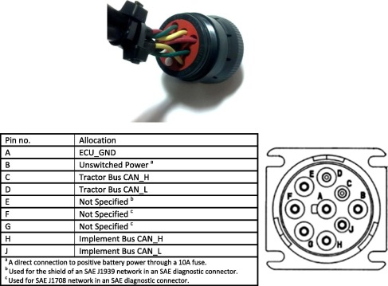

  
  <h3 align="center">_🦌_🚜💨_ Let John fear the deer</h3>

  

## CAN basics:
In general there are two different kinds of SAE J1939 connectors. There are the old ones (black) and the newer ones (green with one pin smaller)

Since you never can be sure if the colors are right, just use a Multimeter to meassure which colors are connected to the CAN-L and CAN-H pins.

(this image contains the pinout in the direction of the image of the plug in the top - from behind!!!)

Usually we only need to connect the CAN-L and CAN-H (C and D) to sniff the bus.

Also keep in mind that the old connector means that the traktor usually uses a baudrate of 250k but in the case of an already installed GPS, the baudrate could also be 500k. If this baudrate is missmatched, you will get a bus violation error message in rapid paste!

## Reports: