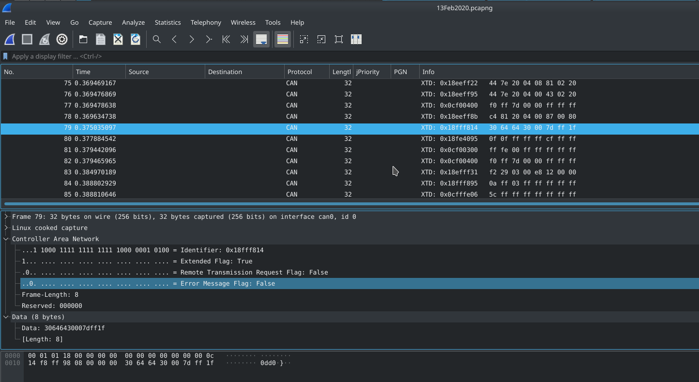
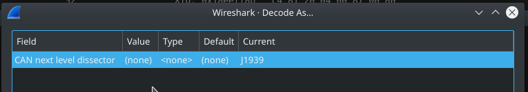
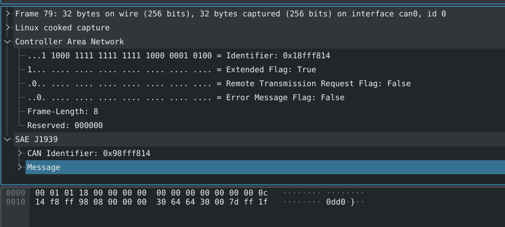

# How to analyse
After sniffing, we need to analyse the data. This is now the current state from this project.

## Wireshark
Before we go on, we would like to ensure that everybody knows the difference between [wireshark][2] and [libCap][5]/[WinCap][6]. [Wireshark][2] does not capture data, it only analyses and processes it, finally it displayes in a human readable format. Capturing is done either via [libCap][5] on [unix][7] systems or with [WinCap][6] on windows (you can also use something different but those are the most used libs for it). 

### Analyse data
 [Wireshare][2] supports us here by decoding the can traffic into [j1939][3] messages. This allows us to filter for PGN numbers and etc. But to receive an human readable string, we need to workout a mapping (DBC file) and apply it to the captured data.

So let's get throw this step by step. After starting the tractor, wireshark should capture raw [CAN bus][4] data. Please see an example screenprint below. 


As already mentioned, [Wireshark][2] is already shipped with an [j1939][3] decoder. To enable it, right click somewhere into the traffic view and select "**Decode as**", which will open following window. (j1939 will not be selected the first time)

In here, we can define the next **dissector** to use. [Wireshare][2] uses so called **dissector** to analyse/extract protocol relevent data from the stream. Further the output from one dissector is piped as input to the next one. Hence this configuration will enable the next deeper level of analysis. As result we will more [j1939][3] relevant data extracted from the raw stream. 
.
Unfortunately the current version does not really offer a human readable format, but this will your task. We will try to rewrite the code from the current dissector later in this project.

Please consider, if you decode the data as [j1939][3] and save it, [wireshare][2] will dump the [j1939][3] data. This can be better visualized by printing the content via [tshark][1] (wireshark command line client).
```
4 0.087929037            0 → 255          J1939 32 6 60928 PGN: 60928    81 90 26 04 00 00 02 20
5 0.124666945           20 → 255          J1939 32 6 60928 PGN: 60928    93 13 20 04 00 11 00 20
6 0.146443979           25 → 255          J1939 32 6 60928 PGN: 60928    b6 86 20 04 00 15 02 20
7 0.162551742          140 → 255          J1939 32 6 60928 PGN: 60928    4d 96 24 04 00 81 02 20
8 0.162576757           50 → 255          J1939 32 6 60928 PGN: 60928    4d 96 24 04 08 43 02 20
9 0.162993098            6 → 255          J1939 32 6 60928 PGN: 60928    4d 96 24 04 00 0e 02 20
10 0.163310927          49 → 255          J1939 32 6 60928 PGN: 60928    4d 96 24 04 00 25 02 20

```

## Python
For POC reason, we will first try to analyse the data with python. Further this will be the approch for continuously data steaming. Please have a look at your jupyter workbook inside pyJohnFear directory. You can find [here](https://jupyter.org/install) the offical installation tutorial.


[1]: (https://www.wireshark.org/docs/man-pages/tshark.html)
[2]: (https://www.wireshark.org/)
[3]: (https://en.wikipedia.org/wiki/SAE_J1939)
[4]: (https://en.wikipedia.org/wiki/CAN_bus)
[5]: (http://www.man7.org/linux/man-pages/man3/libcap.3.html)
[6]: (https://www.winpcap.org/)
[7]: (https://en.wikipedia.org/wiki/Unix)