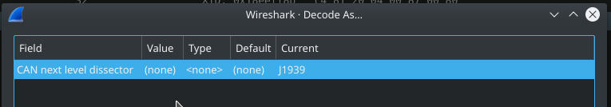
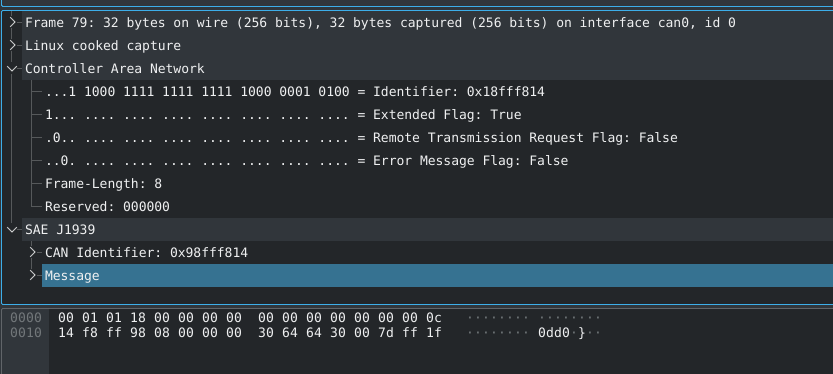

# How to capture
Now finally we will introduce you how to sniff and capture can bus data.
For this we used a [CANable PRO][1] board with candlelight firmware in compination with [wireshark][2].

## Connector
Please see your Hardware [page](./hardware.md) and prepare everything properly. 

## Interface
If your connector is prepared please connect it to your pc. Now we need to bring the native (with candlelight) can device up. Within this step we define the baudrate. 

```
  # command generic
  ip link set <devicename> up type can bitrate <baudrate>;
  ip link set down <devicename>
  
  # set interface down if up
  ip link set down can0

  # j1939 type1
  ip link set can0 up type can bitrate 250000;

  # j1939 type2
  ip link set can0 up type can bitrate 500000;

  # check links - should appear here now
  ip link show
```

If no error occured, `can0` device is not ready for sniffing.
Now you can connect to board to your tractor, we recommend to do this with a stopped engine.

## Wireshark
Start [wireshark][2] and start a new capture for the can device, in your case `can0`.
Before we go on, we would like to ensure that everybody knows the difference between [wireshark][2] and [libCap][5]/[WinCap][6]. [Wireshark][2] does not capture data, it only analyses and processes it, finally it displayes in a human readable format. Capturing is done either via [libCap][5] on [unix][7] systems or with [WinCap][6] on windows (you can also use something different but those are the most used libs for it). 

## Start Engine
Fire up the tractor. It is enought to start board computer without engine first, you should already receive can message yet. If only bus valuation messages pop up, you may have used the wrong baudrate.

## Analyse data
After sniffing, we need to analyse the data. This is now the current state from this project. [Wireshare][2] supports us here by decoding the can traffic into [j1939][3] messages. This allows us to filter for PGN numbers and etc. But to receive an human readable string, we need to workout a mapping (DBC file) and apply it to the captured data.

So let's get throw this step by step. After starting the tractor, wireshark should capture raw [CAN bus][4] data. Please see an example screenprint below. 

As already mentioned, [Wireshark][2] is already shipped with an [j1939][3] decoder. To enable it, right click somewhere into the traffic view and select "**Decode as**", which will open following window. (j1939 will not be selected the first time)

In here, we can define the next **dissector** to use. [Wireshare][2] uses so called **dissector** to analyse/extract protocol relevent data from the stream. Further the output from one dissector is piped as input to the next one. Hence this configuration will enable the next deeper level of analysis. As result we will more [j1939][3] relevant data extracted from the raw stream. .
Unfortunately the current version does not really offer a human readable format, but this will your task. We will try to rewrite the code from the current dissector later in this project.


[1]: (https://canable.io/)
[2]: (https://www.wireshark.org/)
[3]: (https://en.wikipedia.org/wiki/SAE_J1939)
[4]: (https://en.wikipedia.org/wiki/CAN_bus)
[5]: (http://www.man7.org/linux/man-pages/man3/libcap.3.html)
[6]: (https://www.winpcap.org/)
[7]: (https://en.wikipedia.org/wiki/Unix)