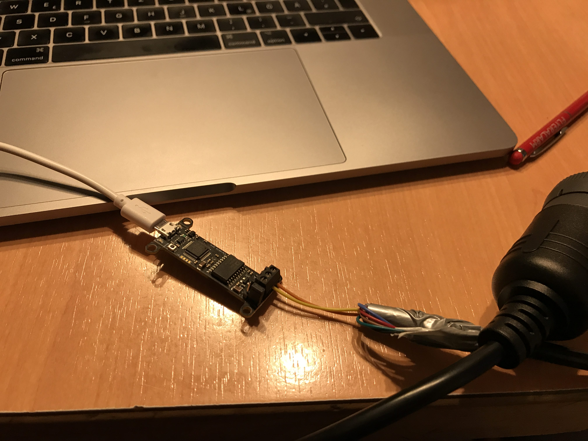
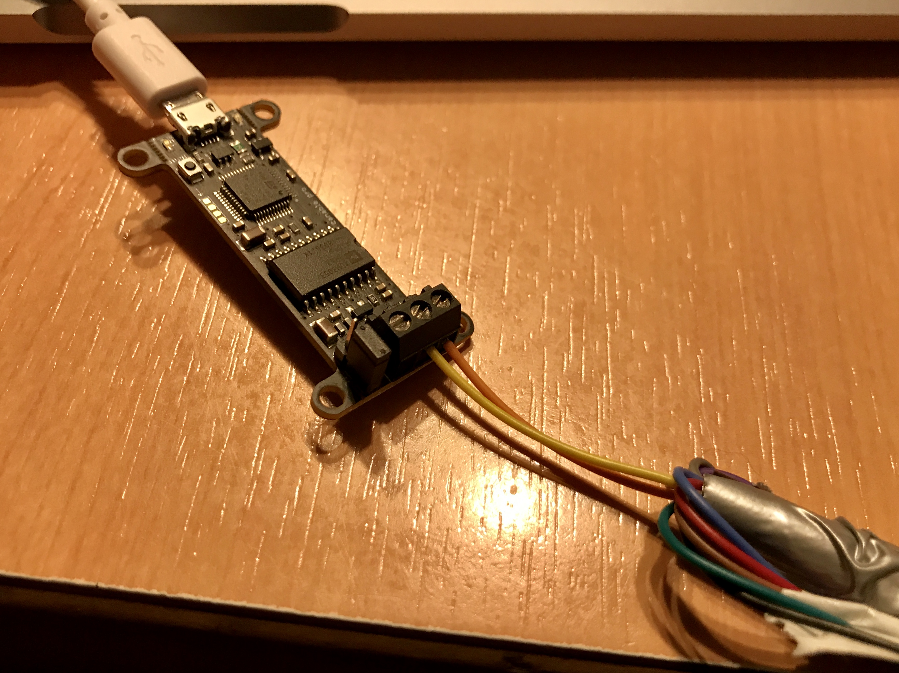

## Report - 13 Feb 2020
First try to capture CAN bus data traffic.

The captured data can be found [here](../../captures/13Feb2020.pcapng)

### Captured movements
1. RPM 900
2. RPM 1200
3. RPM 900
4. Turn signal LEFT
5. Turn signal RIGHT
6. Reverse gear + steering
7. Increase throttle + move forward
8. Park
9. km/h leaver
10. Reverse gear
11. Breaking 5-10x
12. Engine OFF

### Additional images

